# Big Data

La era de los Datos.

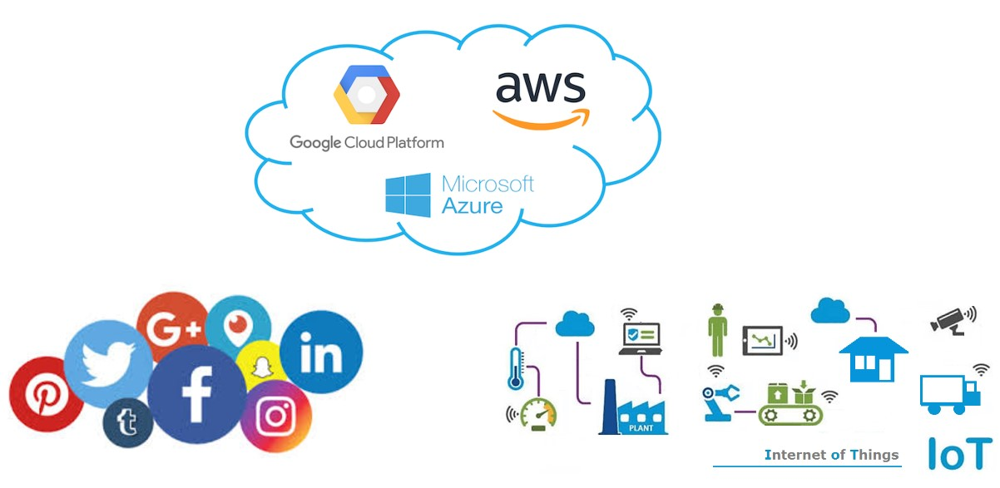

Los sistemas informáticos utilizados hoy en el mundo empresarial, para automatizar los procesos de negocio, tuvieron sus orígenes en el área militar. Entre 1950 y 1960, después de la Segunda Guerra Mundial, Estados Unidos comenzó a promover el uso de programas informáticos para la administración de tareas y organización de su ejército.

De hecho, hasta la década de los 50, las instituciones militares eran prácticamente las únicas que tenían acceso a los primeros equipos informáticos. Estos sistemas de organización han sido declarados como los precursores del ERP (Enterprise Resource Planning).

A partir de 1960 salieron al mercado las primeras computadoras comerciales y se  sentaron las bases de la gestión automatizada, herramientas de planificación, gestión de inventarios, etc.

Por supuesto eran sistemas “primitivos”, pero suponían un gran avance en aquella época.

La década de 1970 se vio marcada por la irrupción de los MRP ó Sistemas de Planificación y Programación de la Producción de la mano de IBM. Estos sistemas ayudaban a planificar los requerimientos de la materia prima que se utilizaba en la fabricación de artículos y productos.

En 1972 se fundó la empresa SAP en Alemania. Las iniciales de la empresa significaban “Sistemas, Aplicaciones y Productos”. El objetivo de SAP era crear software empresarial que funcionara en tiempo real. SAP lanzó su primer programa de contabilidad financiera en 1973.

En 1975, el software MRP ya se utilizaba en multitud de grandes empresas. El sistema funcionaba en enormes ordenadores centrales que eran muy caros, aunque su potencia de cálculo no era comparable ni siquiera a la de algunos de los ordenadores portátiles de hoy en día.

Al entrar en los 80 estos sistemas evolucionaron y se denominaron MRP- II. Incluían un avance importante: ya no solo se encargaban de la gestión de materiales, sino que también administraban recursos económicos. De esta forma, incluyeron elementos financieros presentes en la producción como los costes de la materia prima, mano de obra y organización.

El término ERP (Enterprise Resource Planning) se utilizó por primera vez en la década de 1990. Se centraba en funciones empresariales como la producción, finanzas y contabilidad, recursos humanos, gestión de proyectos, etc. Estaba compuesto por sistemas modulares con características avanzadas.

Con el comienzo del nuevo siglo los ERP se popularizaron. A partir del año 2000 Gartner Group proporcionó funcionalidades como la gestión de la cadena de suministro, la gestión de las relaciones con los clientes (CRM) y la inteligencia de negocio.

A partir del 2005 la tendencia se ha orientado hacia soluciones de software en la nube y se ha alejado de los modelos tradicionales de instalación en los servidores del cliente. Las soluciones de software Cloud ERP proporcionaron funcionalidades comparables a las del ERP local a un coste mucho menor. Desde ese momento se produce un punto de inflexión en el que ya no solo son utilizados por grandes empresas manufactureras sino que se “democratizan” extendiendo su uso a las PYMES.

En consecuencia, se viene registrando datos desde hace décadas. Almacenándose en diferentes formatos. Al principio, se trato de “tablas libres”, los cuales eran archivos binarios alojados en el sistema de archivos. Así era como se generaba y guardaba el dato, hasta que a principios de la década del setenta en los laboratorios de IBM, se creó el nuevo software de base de datos System R. Y para gestionar los datos almacenados en System R, se creó el lenguaje SQL. En un principio se llamó SEQUEL, un nombre que todavía se utiliza como una pronunciación alternativa para SQL, pero más tarde fue renombrado a sólo SQL.

Hasta antes del SQL, para realizar una consulta a los datos, era necesario desarrollar un programa con el mismo lenguaje en que había sido creado, por ejemplo Cobol o Fortran, lo cual suponía una tarea que consumía mucho tiempo.

En 1979, una compañía llamada Relational Software, que luego se convirtió en Oracle, vio el potencial comercial del lenguaje SQL y lanzó su propia versión modificada, denominada Oracle V2.

Cuando hablamos de Big Data nos referimos a conjuntos de datos o combinaciones de conjuntos de datos cuyo tamaño (volumen), complejidad (variabilidad) y velocidad de crecimiento (velocidad) dificultan su captura, gestión, procesamiento o análisis mediante tecnologías y herramientas convencionales, tales como bases de datos relacionales y estadísticas convencionales o paquetes de visualización, dentro del tiempo necesario para que sean útiles.

Aunque el tamaño utilizado para determinar si un conjunto de datos determinado se considera Big Data no está firmemente definido y sigue cambiando con el tiempo, la mayoría de los analistas y profesionales actualmente se refieren a conjuntos de datos que van desde 30-50 Terabytes a varios Petabytes.

La naturaleza compleja del Big Data se debe principalmente a la naturaleza no estructurada de gran parte de los datos generados por las tecnologías modernas, como los logs de servidores web, los sensores incorporados en dispositivos, las búsquedas en Internet, las redes sociales, computadoras portátiles, teléfonos inteligentes y otros teléfonos móviles, dispositivos GPS, registros de centros de llamadas y en general todo lo que refiere a tecnología multimedia, es decir, imágenes, audio y video.

En la mayoría de los casos, con el fin de utilizar eficazmente el Big Data, debe combinarse con datos estructurados (normalmente de una base de datos relacional) de una aplicación comercial más convencional, como un ERP (Enterprise Resource Planning) o un CRM (Customer Relationship Management).

Lo que hace que Big Data sea tan útil para muchas empresas es el hecho de que proporciona respuestas a muchas preguntas que las empresas ni siquiera sabían que tenían. En otras palabras, proporciona un punto de referencia. Con una cantidad tan grande de información, los datos pueden ser moldeados o probados de cualquier manera que la empresa considere adecuada. Al hacerlo, las organizaciones son capaces de identificar los problemas de una forma más comprensible.

La recopilación de grandes cantidades de datos y la búsqueda de tendencias dentro de los datos permiten que las empresas se muevan mucho más rápidamente, sin problemas y de manera eficiente. También les permite eliminar las áreas problemáticas antes de que los problemas acaben con sus beneficios o su reputación.

El análisis de Big Data ayuda a las organizaciones a aprovechar sus datos y utilizarlos para identificar nuevas oportunidades. Eso, a su vez, conduce a movimientos de negocios más inteligentes, operaciones más eficientes, mayores ganancias y clientes más felices. Las empresas con más éxito con Big Data consiguen valor de las siguientes formas:

    • Reducción de coste. Las grandes tecnologías de datos, como Hadoop y el análisis basado en la nube, aportan importantes ventajas en términos de costes cuando se trata de almacenar grandes cantidades de datos, además de identificar maneras más eficientes de hacer negocios.
    • Más rápido, mejor toma de decisiones. Con la velocidad de Hadoop y la analítica en memoria, combinada con la capacidad de analizar nuevas fuentes de datos, las empresas pueden analizar la información inmediatamente y tomar decisiones basadas en lo que han aprendido.
    • Nuevos productos y servicios. Con la capacidad de medir las necesidades de los clientes y la satisfacción a través de análisis viene el poder de dar a los clientes lo que quieren. Con la analítica de Big Data, más empresas están creando nuevos productos para satisfacer las necesidades de los clientes.

### 3V’s de Big Data

Las especiales características del Big Data hacen que su calidad de datos se enfrente a múltiples desafíos. Se trata de las conocidas como 3 Vs: Volumen, Velocidad y Variedad que definen la problemática del Big Data.
Estas características del Big Data provocan que las empresas tengan problemas para extraer datos reales y de alta calidad, de conjuntos de datos tan masivos, cambiantes y complicados.

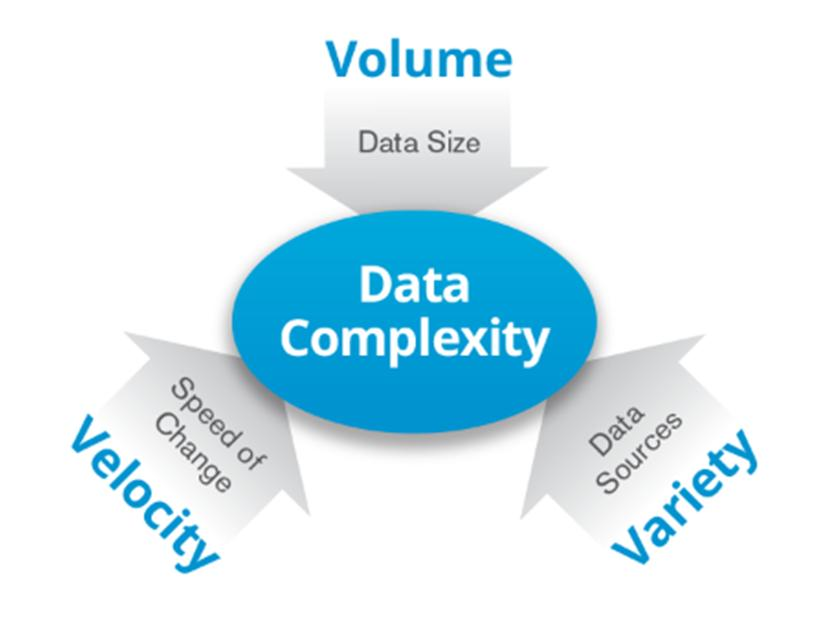

### Casos de Uso

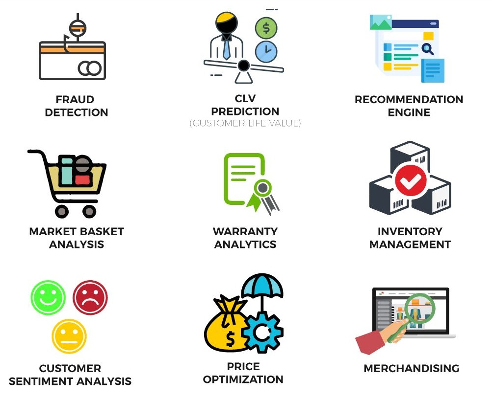

### Data Lake

Dada la afluencia en los últimos tiempos, del uso de Internet y la tecnología de redes en general, como por ejemplo sensores o APIs, concretamente el desarrollo de lo que se conoce como IoT (Internet de las Cosas), se comenzó a trabajar datos que no necesariamente son llevados a una estructura tabular, dentro de un Data Warehouse y se manejan por fuera del mismo, dando lugar al desarrollo de una serie de herramientas conocidas como motores de bases de datos No-SQL y al desarrollo de una arquitectura conocida como Data Lake, la cuál contempla el almacenamiento y disponibilización de todo tipo de datos, estructurados y no estructurados, manejando esa variedad y tambien soportando grandes volúmenes de datos, que tambien se genera a gran velocidad. Éstas tres características, son conocidas como las 3 V del Big Data, y una diferencias notoria respecto de un proceso de ETL tradicional, es que esas fases se reordenan, dando lugar a un concepto conocido como ELT, donde primero se realiza la extracción al igual que en un ETL, pero luego se hace la carga de los datos, sin necesariamente pasar por un proceso de transformación, proceso que llega luego bajo la necesidad de analizar ese dato. Por eso se define que el Data Warehouse consiste en un esquema “On Write” y el Data Lake en un esquema “On Read”, en este último, se almacenan todos los datos que se generan, aún si todavía se desconoce si luego no va a utilizarse.

* Es un repositorio unificado de datos, estructurados y no estructurados.
* Está diseñado soportar las cargas de trabajo de Big Data y Machine Learning.
* Prioriza el almacenamiento de los datos en su formato original para luego ser procesados de acuerdo a la demanda.

### Estrategia de Procesamiento

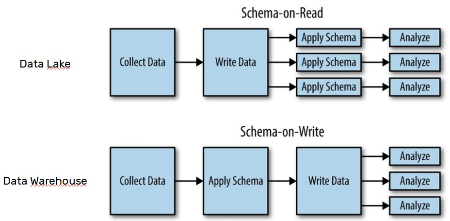

### Arquitectura

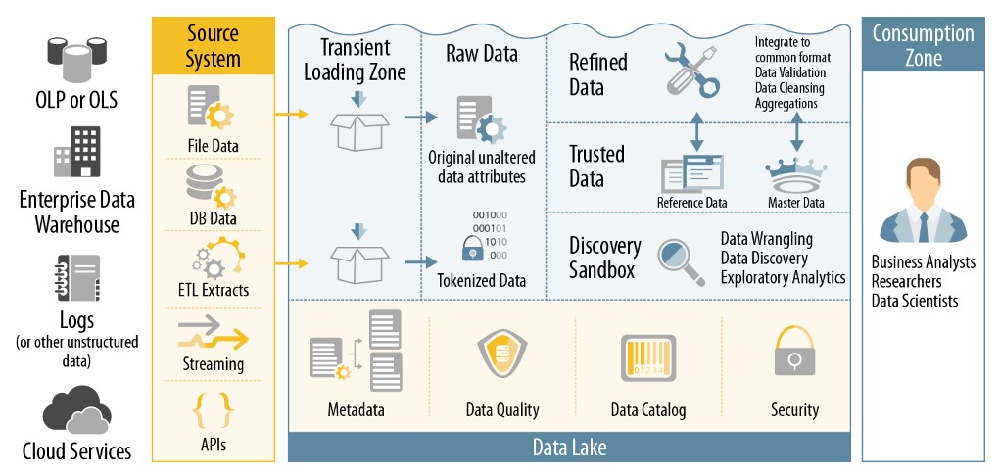

## Hadoop

Es un sistema open-source diseñado para almacenar y procesar Big Data de forma distribuida utilizando un cluster de servidores.

### Características:
* Tolerancia a Fallos.
* Escalabilidad Horizontal.
* Utiliza commodity hardware.
* Desarrollado en lenguaje Java.
* Procesamiento en paralelo.

- [Sitio Oficial](https://hadoop.apache.org/)

### Ecosistema Hadoop

## Cluster Hadoop

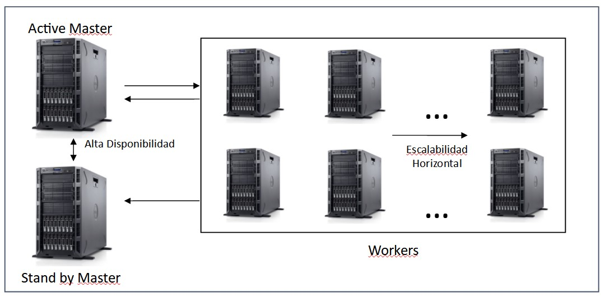

## Componentes Core

### HDFS (Hadoop Distributed File System)

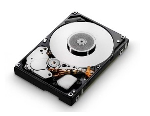

Master -> NameNode
Worker -> DataNode

Hadoop permite organizar computadoras en una relación maestro – esclavo que contribuye a conseguir una gran escalabilidad para el procesamiento.

Un Cluster Hadoop tiene dos tipos de nodos, un único “Master Node” llamado NameNode y un gran número de “Workers Nodes” llamados DataNodes.

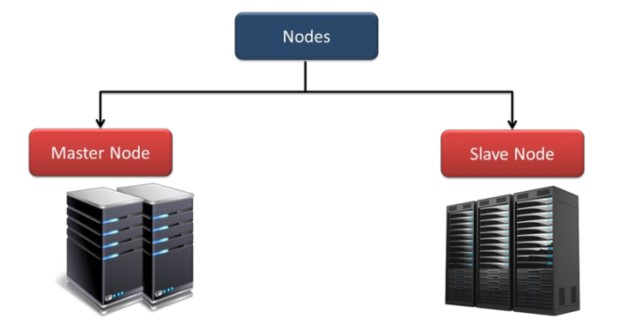

El Masternode administra el sistema de archivos, su “namespace” y controla el acceso a los archivos por los clientes, conociendo qué bloques de qué archivos están en cada DataNode.
Un único MasterNode implica la necesidad de “Hot backups” para mantener la disponibilidad del servicio.

El MasterNode usa un log de transacciones para mantener un registro de cada cambio que ocurre en el sistema de archivos.

Los DataNodes almacenan los bloques de datos en el espacio de almacenamiento dirigidos por el MasterNode.

Cada DataNode típicamente contiene muchos discos para maximizar la capacidad de almacenamiento y la velocidad de acceso, y tienen su propio sistema de archivos local.
Los DataNodes almacenan y distribuyen bloques de datos sobre la red usando un protocolo de bloques, gestionado por el DataNode.

Los NameNodes almacenan toda la información relevante acerca de todos los DataNodes, y los archivos almacenados en los DataNodes:

* Para cada DataNode, su nombre, rack, capacidad y estado.
* Para cada archivo, su nombre, réplicas, tipo, tamaño, "timeStamp", ubicación, estado.

El NameNode trata de asegurar que los archivos se distribuyan de forma pareja entre los DataNodes del clúster, también optimiza el ancho de banda y balancea la carga de procesamiento y almacenamiento.

Cada pieza de datos es almacenado típicamente en tres nodos, dos en el mismo rack y uno en un rack diferente.

Si un DataNode falla, éste puede ser recreado automáticamente en otra computadora, escribiéndose todos los bloques de archivos desde réplicas (otros DataNodes).

Los DataNodes se comunican por medio de mensajes ("heartbeats") para conocer el estado de los nodos. Sin ese mensaje se considera que el nodo ha fallado, y la replicación automáticamente reemplaza el nodo fallido.

En el Sistema de Bloques ("block system"), un bloque es la unidad fundamental de almacenamiento en HDFS. Se almacena la información de grandes archivos distribuyendo segmentos llamados bloques para ser almacenados en diferentes computadoras.
El tamaño predeterminado de los bloques es de 64 o 128 MB dependiendo de la distribución:

hdfs getconf -confKey dfs.blocksize

Cada archivo de datos ocupa un determinado número de bloques, dependiendo de su tamaño y organizado en bloques consecutivos, para facilidad y velocidad de acceso.
El tamaño de bloques y el factor de replicación puede ser configurado según se requiera.

Respecto de la Integridad de los datos, Hadoop asegura que no habrá pérdida o corrupción de datos durante el procesamiento y almacenamiento.

Los datos son escritos sólo una vez y nunca actualizados en el lugar, pueden ser leídos muchas veces.

Sólo un cliente a la vez puede escribir o agregar datos al archivo, no se permiten actualizaciones concurrentes.

Si algunos datos en un DataNode se pierden o corrompen, o hay una falla en el disco que los contiene, una nueva réplica en buen estado es recreada automáticamente desde una réplica en otro DataNode. Al menos una réplica es almacenada en un DataNode en un rack diferente.

Los archivos de entrada pueden variar desde pequeños a extremadamente grandes y con diferentes estructuras.

Los archivos secuenciales ("secuence files") son una estructura especializada de datos dentro de Hadoop para manejar pequeños archivos en registros pequeños.

Utilizan una estructura de datos persistentes HDFS y MapReduce están diseñados para gestionar archivos de gran tamaño, de manera que "empaquetar“ archivos pequeños en archivos secuenciales hace más eficiente su procesamiento y almacenamiento.

#### Ejemplo de escritura en HDFS

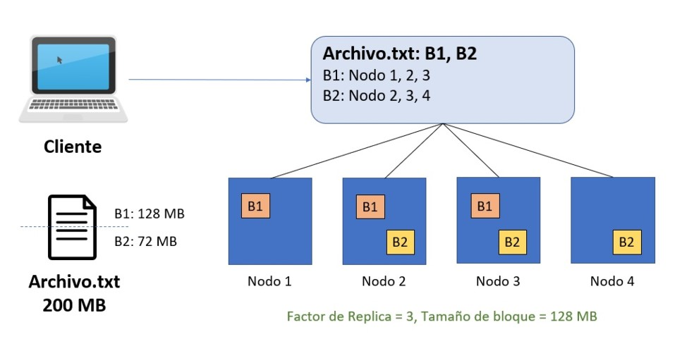

### YARN (Yet Another Resource Negotiator)

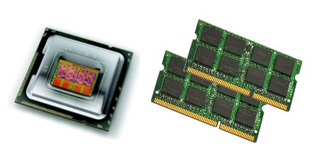

Master -> ResourceManager
Worker -> NodeManager

Es el centro de la arquitectura de Hadoop, caracterizado como un sistema Operativo distribuido para aplicaciones de Big Data.

YARN administra recursos y "workloads" en un entorno seguro mientras asegura la alta disponibilidad en múltiples clusters Hadoop.

YARN brinda flexibilidad como una plataforma común para ejecutar múltiples aplicaciones y herramientas, de consultas interactivas SQL (Hive), de proceso de flujos en tiempo real (Spark), y procesamiento por lotes (MapReduce) para trabajar con los datos almacenados en una plataforma HDFS.

Brinda gran escalabilidad para expandirse más allá de 1000 nodos y provee ubicación dinámica de recursos del clúster.

#### Ejemplo de ejecución de Jobs en YARN

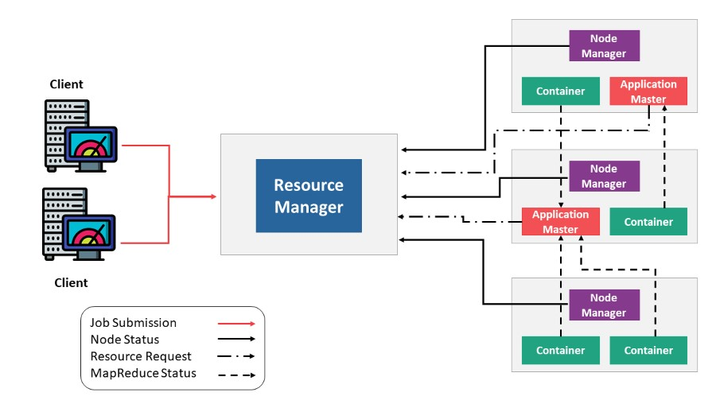

- [YARN] (https://hadoop.apache.org/docs/stable/hadoop-yarn/hadoop-yarn-site/YARN.html)

## MapReduce

Permite procesar enormes cantidades de datos utilizando los servicios de gran cantidad de computadoras para trabajar en diferentes partes del trabajo ("job") simultáneamente, brindando capacidad de procesamiento en paralelo y tolerancia a fallos.

La tarea de procesamiento de los datos se divide en muchas partes, cada una procesada de forma independiente de las otras y luego los resultados intermedios se combinan en el resultado final.

MapReduce es un "framework" de procesamiento paralelo para acelerar el procesamiento de datos a gran escala, con un mínimo movimiento de los dados en el sistema de archivos distribuido del clúster Hadoop, obteniendo resultados cercanos al tiempo real.

- [MapReduce] (https://hadoop.apache.org/docs/stable/hadoop-mapreduce-client/hadoop-mapreduce-client-core/MapReduceTutorial.html)

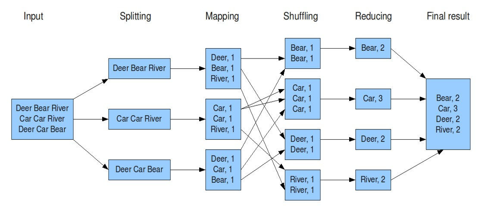

La función map(): se encarga del mapeo y es aplicada en paralelo para cada ítem en
la entrada de datos. Esto produce una lista de pares (k2,v2) por cada llamada.

Luego el se juntan todos los pares con la misma clave de todas las listas y los agrupa, creando un grupo por cada una de las diferentes claves generadas.

Desde el punto de vista de la arquitectura, el nodo master toma el input, lo divide en
pequeñas piezas o problemas de menor identidad, y los distribuye a los denominados
"worker nodes".

Un "worker node" puede volver a sub-dividir, dando lugar a una estructura de árbol.

El "worker node" procesa el problema y pasa la respuesta al nodo maestro "master node".

La función reduce es aplicada en paralelo para cada grupo, produciendo una colección
de valores para cada dominio:

Reduce(k2, list (v2)) -> list(v3)

Típicamente se produce un valor v3 o una llamada vacía, aunque una llamada puede retornar más de un valor. El retorno de todas esas llamadas se recoge como la lista de resultado deseado.

Por lo tanto, el framework MapReduce transforma una lista de pares (clave, valor) en una lista de valores.

## Instalación Hadoop

Se puede instalar Hadoop en un clúster de computadoras "on premise" o utilizar servicios en la nube: Azure, IBMCloud, AWS.
Requiere una instalación de Java y está escrito en ese lenguaje.
Para instalaciones locales es útil contar con una interfaz gráfica como Cloudera Resouces Manager que permite la instalación de Hadoop y componentes relacionados, como YARN, HBase, Pig.
Si se instala desde la línea de comandos, se debe descargar Hadoop de algunos de
los "mirrors" de Apache. 
La instalación en la nube es más sencilla que instalar Java Virtual Machines en computadoras locales.
HDFS tiene una interfase de línea de comandos "UNIX-like".
Use el "shell" sh para comunicarse con Hadoop.

## Práctica en Clase

1) Realizar la instalación de VirtualBox: https://www.virtualbox.org/wiki/Downloads
2) Realizar la instalación de Putty: https://www.putty.org/ - https://www.compuhoy.com/como-descargo-putty-en-linux/
3) Realizar la instalación de WinSCP: https://winscp.net/eng/download.php (FileZilla es una alternativa si no usas sistema operativo Windows)
4) En el archivo "Servidor_Ubuntu.zip" hay disponible un archivo VDI necesario para crear una máquina virtual Linux en VirtualBox. Esta máquina virtual es un servidor Ubuntu:   usuario: ubuntu  
contraseña: ubuntu  
Ya contiene una instalación de Docker. Por lo que a y b son opcionales: 
a) Instalación de Docker en tu sistema operativo: https://hub.docker.com/ 
b) Si el sistema operativo usado es Linux: https://docs.docker.com/engine/install/ 
    sudo apt install -y docker-compose 
5) Comenzar a familiarizarse con los comandos de Linux: 
[Tutorial] (https://www.tutorialspoint.com/unix_commands/index.htm) 
[Interactivo] (https://cli-boot.camp/?id=1dbj970vv4n) 
6) Una vez que tenemos todo funcionando, habiendo escogido cualquiera de las opciones ya podemos crear el cluster Hadoop siguiendo las siguientes instrucciones: 
6.1-Probemos la instalación de Docker: “sudo docker run hello-world” 
6.2-Descarguemos desde GitHub lo necesario para ejecutar el cluster: 
git clone https://github.com/soyHenry/DS-M4-Cluster_Hadoop 
6.3-Revisemos el archivo “start-container.sh”, los archivos dentro de la carpeta “config” y la URL “localhost:8088”. (Si usamos la máquina virtual, en lugar de localhost va la ip local de la misma) 
6.4-Finalmente sigamos las instrucciones propuestas para ver en funcionamiento HDFS y MapReduce sobre Hadoop.

## Homework

En el M3 se trabajó con con conjunto de datos que simulaban una empresa de venta de productos, deberás tomar ese mismo proceso de ETL y realizarlo con las herramientas Big Data que se verán en este módulo. Para esto, se provee de un entorno integrador:
https://github.com/soyHenry/DS-M4-Herramientas_Big_Data

Realizar el ejercicio propuesto en el punto 1 de la práctica integradora.