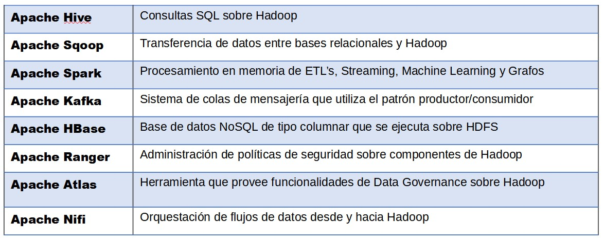
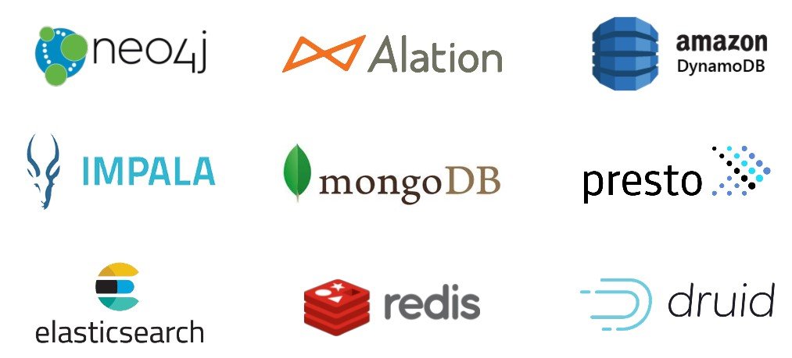
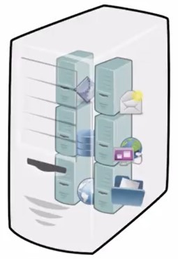
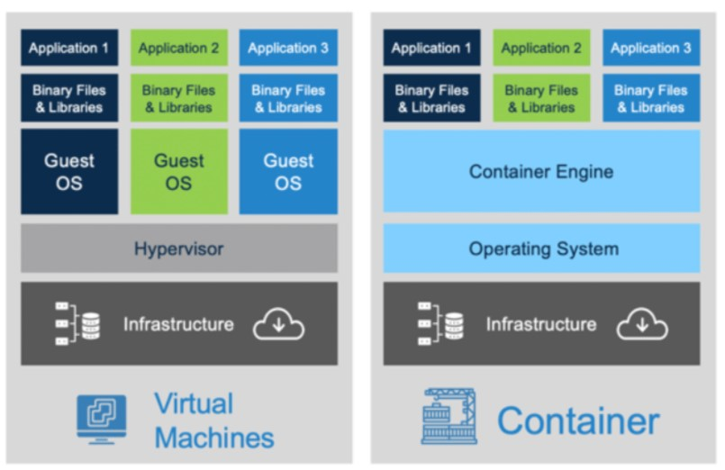
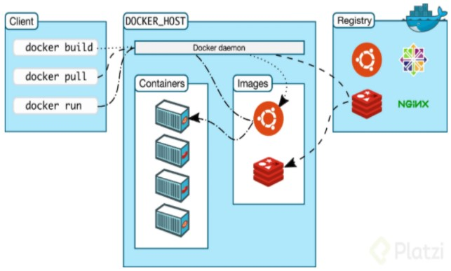
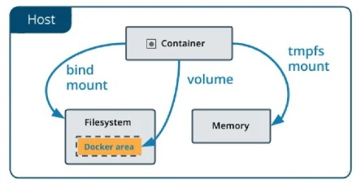
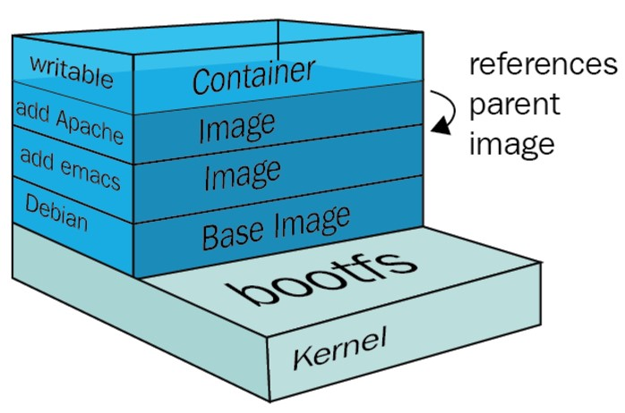

# Frameworks Hadoop



## Proveedores de Servicios (Vendors) de grado empresarial

* Cloudera https://www.cloudera.com/
* Amazon EMR https://aws.amazon.com/es/emr/
* Azure HDInsight https://azure.microsoft.com/es-es/services/hdinsight/
* IBM Analytics Engine https://cloud.ibm.com/catalog/services/analytics-engine
* Google Dataproc https://cloud.google.com/dataproc
* MapR https://mapr.com/

### Otras tecnologías Big Data



# Virtualización

## Máquinas Virtuales

Es la versión virtual de algún recurso tecnológico, como Hardware, un sistema operativo, un dispositivo de almacenamiento o recurso de red.
Esa virtualización, es un sistema huésped que ejecuta sobre un sistema anfitrión, sin embargo tiene su propio sistema de archivos, que pueden tener múltiples formatos, como ser VDI, VMDK, VHD ó raw entre otros.



## Docker

Utiliza contenedores, y lo que hacen es reutilizar el kernel, que es la parte mas profunda del SO de la maquina anfitriona, manejando de forma más óptima recursos que ya están disponibles en el SO anfitrión.
Esa containerización, trae consigo las ventajas de ser más liviana, portable, de bajo acoplamiento debido a que los contenedores son autocontenidos (no afecta a los demás para su funcionamiento), escalable y segura.




Corre nativamente en Linux, por eso para otros SO levanta una máquina virtual.

Componentes del Docker Engine:
* Docker daemon: Es el centro de docker, por medio del cual, es posible la comunicación con los servicios de docker.
* REST API: Como cualquier otra API, es la que nos permite visualizar docker de forma “gráfica”.
* Cliente de docker: Permite la comunicación con el centro de docker (Docker Daemon) que por defecto es la línea de comandos.



Dentro de la arquitectura de Docker encontramos:<br>
    1. Contenedores: Se encapsulan las imagenes para llevarlas a otra computadora 	o servidor, etc.<br>
    2. Imágenes: Se puede correr una aplicación específica.<br>
    3. Volúmenes de datos: Se puede acceder con seguridad al sistema de archivos 	de la máquina anfitrión.<br>
    4. Redes: Permiten la comunicación entre contenedores.<br>
<br>
Es una arquitectura cliente-servidor, se comunican mediante una API para poder gestionar el ciclo de vida de los contenedores y así poder construir, ejecutar y distribuirlos.

### ¿Qué es un contenedor?



* Agrupación de procesos.
* Entidad lógica, no tiene el límite estricto de las máquinas virtuales.
* Ejecuta sus procesos de forma nativa.
* Los procesos que se ejecutan adentro de los contenedores ven su universo como el contenedor lo define, no pueden ver mas allá del contenedor, a pesar de 	estar corriendo en una maquina más grande.
* No tienen forma de consumir más recursos que los que se les permite.
* Sector del disco: Cuando un contenedor es ejecutado, el daemon de docker 	    establece a qué parte puede acceder.
* Docker hace que los procesos adentro de un contenedor estén aislados del resto del sistema, no le permite ver más allá.
* Cada contenedor tiene un ID único, también tiene un nombre.

### ¿Qué es una imágen?

Se parte desde la base del SO Linux, y se agrega capas de personalización hasta obtener la imágen deseada:

Ejemplo:
    1. Distribución Debian
    2. Editor emacs
    3. Servidor Apache
    4. Permisos de escritura para la 	carpeta /var/www de Apache




### Docker Compose

* Herramienta que permite simplificar el uso de Docker a partir de archivos YAML, con los que es mas sencillo crear contendores, conectarlos, habilitar puertos, volumenes, etc.
* Se pueden crear diferentes contenedores y al mismo tiempo, en cada contenedor, diferentes servicios, unirlos a un volúmen común, iniciarlos y apagarlos, etc.
* Componente fundamental para poder construir aplicaciones y microservicios.
* Permite poder instruir al Docker Engine a realizar tareas, programáticamente siendo ésta la clave: La facilidad para dar una serie de instrucciones, y luego repetirlas en diferentes ambientes.
* Describe de forma declarativa la arquitectura de servicios necesaria en un archivo donde se declara lo que debe suceder.

Comandos:
1)	$ docker-compose up -d (crea todo lo declarado en el archivo docker-compose.yml)
2)	$ docker network ls (listo las redes)
3)	$ docker network inspect docker_default (veo la definición de la red)
4)	$ docker-compose logs (veo todos los logs)
5)	$ docker-compose logs app (solo veo el log de “app”)
6)	$ docker-compose logs -f app (hago un follow del log de app)
7)	$ docker-compose exec app bash (entro al shell del contenedor app)
8)	$ docker-compose ps (veo los contenedores generados por docker compose)
9) 	$ docker-compose down (borro todo lo generado por docker compose)
10)	$ docker-compose build (crea las imágenes)
11)	$ docker-compose up -d (crea los servicios/contenedores)

### Enlaces recomendados:

* https://phoenixnap.com/kb/docker-run-command-with-examples

## Práctica En Clase

### Consideraciones:

* Es necesario tener instalado Docker.
* Registrarnos en Docker Hub.
* Al ejecutar las instrucciones, anteponer “sudo”.

#### Ejecutar en la consola el contenedor “hello-world” del Docker-Hub y luego verificar si está ejecutando:
1) $ docker run hello-world (corro el contenedor hello-world)
2) $ docker ps (muestra los contenedores activos)
#### Ejecutar una inspección de un contenedor específico
3) $ docker ps -a (muestra todos los contenedores)
4) $ docker inspect \<container ID\> (muestra el detalle completo de un contenedor)
5) $ docker inspect \<name\> (igual que el anterior pero invocado con el nombre)
#### Ejecutar el contenedor “hello-world” asignandole un nombre distinto.
6) $ docker run -d –-name hola-mundo hello-world (le asigno un nombre custom “hola-mundo”)
7) $ docker rename hola-mundo hola-a-todos (cambio el nombre de hola-mundo a hola-a-todos)
#### Ejecutar la eliminación de un contenedor (usar rm y prune)
8) $ docker rm \<ID o nombre\> (borro un contenedor)
9) $ docker container prune (borro todos lo contenedores que esten parados)
10) Explorar Docker Hub y probar ejecutar alguna de las imagenes.
https://hub.docker.com/
### 11) Ejecutar la imagen “ubuntu”:
  1) 	$ docker run ubuntu (corre un ubuntu pero lo deja apagado)

  2) 	$ docker run -it ubuntu (lo corre y entro al shell de ubuntu)

		-i: interactivo

		-t: abre la consola

  corre el siguiente comando en la consola de linux $ cat /etc/lsb-release (veo la versión)
### Ejecutar la imagen “nginx” y probar los comandos “stop” y “rm”
  3) $ docker run -d --name proxy nginx (corro un nginx)
  4) $ docker stop proxy (apaga el contenedor)
  5) $ docker rm proxy (borro el contenedor)
  6) $ docker rm -f \<contenedor\> (lo para y lo borra)
###  12) Ejecutar nginx exponiendo el puerto 8080 de mi máquina
  1) 	Exponer contenedores:

  $ docker run -d --name proxy -p 8081:80 nginx (corro un 		nginx y expongo el puerto 80 del contenedor en el puerto 		8080 de mi máquina)

  2) 	localhost:8081 (desde mi navegador compruebo que funcione)
### 13) Ejecutar el comando logs para ver los logs del contenedor de nginx:
  1) 	$ docker logs proxy (veo los logs)
  2) 	$ docker logs -f proxy (hago un follow del log)
### 14) Ejecutar comando “logs –tail” para ver las últimas N entradas de log
  1)	$ docker logs --tail 10 -f proxy (veo y sigo solo las 10 			últimas entradas del log)
### 15) Ejecutar la imagen “mongodb” y asociarla con un directorio en mi máquina
  1) $ mkdir dockerdata (creo un directorio en mi máquina)
  2) $ docker run -d –-name mongodb -v \<path de mi maquina\>:\<path dentro del contenedor(/data/db)\> mongo (corro un contenedor de mongo y creo un bind mount)

  Se debe entrar al directorio creado y desde ahí ejecutar el siguiente comando (o en su defecto copiar el resultado de pwd dentro del directorio en nuestra declaración):

  docker run -d --name mongodb -v "\$(pwd)":/data/db mongo

  De arrojar error Exited (132) debemos usar otra versión (4.4 por ejemplo) usango mogno:X.X en vez de mongo solamente.2
### 16) Ejecutar el comando “exec” para introducirse en el shell de un contenedor:
  3) $ docker ps (veo los contenedores activos)
  4) $ docker exec -it mongodb bash (entro al bash del contenedor)
### 17) Ejecutar los siguientes comandos:
  1) $ mongo (me conecto a la base de datos)
  2) show dbs (listo las bases de datos)
  3) use prueba (creo la base “prueba”)
  4) db.prueba.insert({‘color’: ’azul’}) (inserto un nuevo dato)
  5) db.prueba.find() (veo el dato que cargué)
  6) Revisar el contenido del directorio creado
  7) Volver a ejecutar el contenedor mongodb y verificar que el dato insertado en una ejecución previa ya se pueda ver, debido a que la nueva ejecución levanta lo datos ligados mediante Bind.
  Se debe usar el comando ```docker container start mongodb``` si está parado
### 18) Volúmenes
1) $ docker exec -it mongodb bash (ingresar al contenedor)
2) $ mongo (conectarse a la BBDD)
3) 	show dbs #se listan las BBDD

	use prueba #se crea la BBDD prueba

	db.prueba.insert({“color”:“azul”}) #se carga un dato

	db.prueba.find() #se visualiza el dato cargado
4) Y al crear un nuevo contenedor se usa el mismo

  $ docker run -d --name db --mount type=bind,source='/home/ubuntu/dockerdata',target='/data/db' mongo
5) $ docker run -d --name ubuntu_test ubuntu tail -f /dev/null
6) $ docker exec -it ubuntu_test bash
7) En el contendedor, se crea el directorio “test”, al salir del contenedor para copiar un archivo dentro del contenedor:
$ docker cp test.txt ubuntu_test:test
8) Copiar desde el contenedor a la máquina anfitrión:
$ docker cp ubuntu_test:test [carpeta local]
### 19) Imagenes:
1) $ docker image ls (ver las imágenes que tengo localmente)

$ docker pull ubuntu:20.04 (bajo la imagen de ubuntu con una versión específica)

2)	$ mkdir imagenes (creo un directorio en mi máquina)

	$ cd imagenes (entro al directorio)

  $ touch hola.txt (creo un archivo txt y dentro ingreso la palabra 'hola')

$ touch Dockerfile (creo un Dockerfile)

$ vi Dockerfile (abro el Dockerfile con editor de textos 'vi')

3) 
##Contenido del Dockerfile##

FROM  ubuntu:20.04 \
COPY /hola.txt / \
RUN cat /hola.txt

##fin##

4) $ docker build -t ubuntu:latest . (creo una imagen con el contexto de build \<directorio\>)

$ docker run -it ubuntu:latest (corro el contenedor con la nueva imagen)

$ docker login (me logueo en docker hub)

$ docker tag ubuntu:latest miusuario/ubuntu:latest (cambio el tag para poder subirla a mi docker hub)

5) $ docker push miusuario/ubuntu:latest (publico la imagen a mi docker hub)

* La importancia de entender el sistema de capas consiste en la optimización de la construcción del contenedor para reducir espacio ya que cada comando en el dockerfile crea una capa extra de código en la imagen.

* Con docker commit se crea una nueva imagen con una capa adicional que modifica la capa base.

6) Ejemplo: crear una nueva imagen a partir de la imagen de Ubuntu.

	docker pull ubuntu

	docker images

	docker run -it cf0f3ca922e0 bin/bash

	(modificar el contenedor: Ej apt-get install nmap)

	docker commit deddd39fa163 ubuntu-nmap

7) $ docker history ubuntu:ubuntu2 (ver la info de como se construyó cada capa)

 $ dive ubuntu:ubuntu2 (ver la info de la imagen con el programa dive)
### 20) Redes
Ejecutar los siguientes comandos:
1)	$ docker network ls (listar las redes)
2)	$ docker network create --attachable test_red (crear la red)
3) 	$ docker inspect test_red (ver definición de la red creada)
4) 	$ docker run -d --name db mongo (creo el contenedor)
5)	$ docker network connect test_red db (conecto el contenedor “db” a la red “test_red”)
6) 	$ docker run -d --name app -p 3000:3000 --env MONGO_URL=mongodb://db:27017/test ubuntu (corro el contenedor “app” y le paso una variable)
7)	$ docker network connect test_red app (conecto el contenedor “app” a la red “test_red”)

## Homework

En el M3 se trabajó con con conjunto de datos que simulaban una empresa de venta de productos, deberás tomar ese mismo proceso de ETL y realizarlo con las herramientas Big Data que se verán en este módulo. Para esto, se provee de un entorno integrador:
https://github.com/soyHenry/DS-M4-Herramientas_Big_Data

Verifica dentro de la práctica integradora, cuáles son las imágenes que se utilizan, y qué volúmenes, y cómo se podría persisitir todo lo que se vaya trabajando dentro de los contenedores.