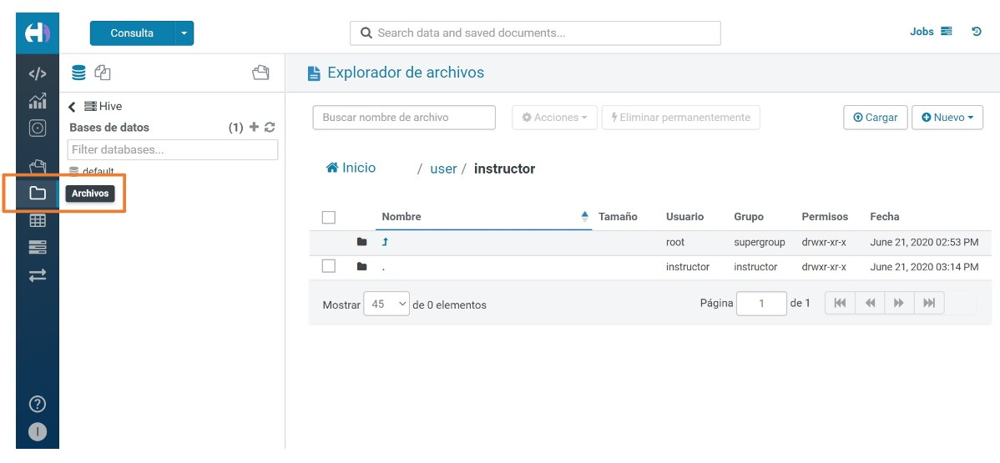
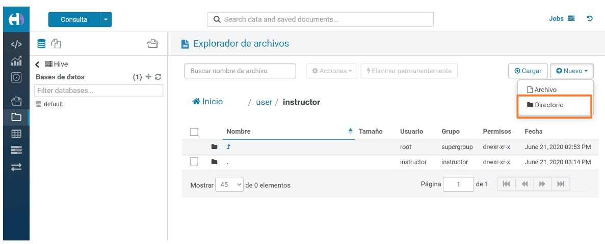
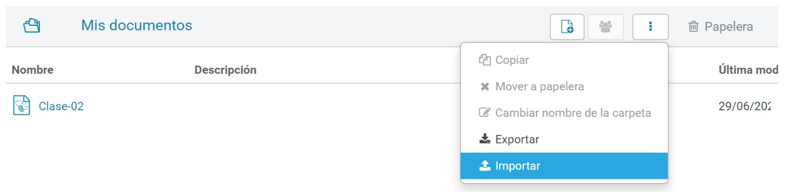

# Hive

* Permite crear infraestructuras de tipo de data warehouse sobre Hadoop para realizar análisis de grandes volúmenes de datos.
* Asigna una estructura tabular (metadata) a los datos en bruto almacenados en HDFS.

### HiveQL (Hive Query Language)

* Hive utiliza un subconjunto de comandos SQL.
* Data Definition Language https://cwiki.apache.org/confluence/display/Hive/LanguageManual+DDL
* Data Manipulation Language https://cwiki.apache.org/confluence/display/Hive/LanguageManual+DML
* Las operaciones de UPDATE y DELETE no están habilitadas por defecto. 

### Tipos de Tablas

| MANAGED | EXTERNAL |
| :------ | -------: |
| Hacen referencia a un path dentro de HDFS que es administrado por Hive | Generan metadata para un path de HDFS que no es administrado por Hive |
| El valor por defecto se especifica en en el parámetro hive.metastore.warehouse.dir y tipicamente es /user/hive/warehouse/ | Debemos agregar la palabra clave EXTERNAL y especificar el path de HDFS en la sección LOCATION |
| En caso de realizar una operación de tipo DROP TABLE, Hive eliminaría la metadata de la tabla y los datos | En caso de realizar una operación de tipo DROP TABLE, Hive eliminaría la metadata de la tabla pero no los datos |

### Tipos de Datos

Hive, además de los tipos de datos comunes a todos los motores de bases de datos relacionales, ofrece una nueva categoría de tipos de datos complejos:

* ARRAY<data_type> 
* MAP<primitive_type, data_type> 
* STRUCT<col_name : data_type, ...>

### Formatos de Almacenamiento

Hive permite leer y escribir datos en diferentes formatos de archivos.
Habitualmente se utilizan 2 formatos:

* CSV para los datos en bruto 
* Parquet para los datos procesados

### Particiones

El particionamiento es una forma de dividir una tabla en partes relacionadas en función de los valores de columnas particulares (por ej. fecha, la ciudad y el departamento). 
Cada tabla puede tener una o más claves de partición para identificar una partición particular. 
Esta forma de almacenar los datos permite realizar consultas mas eficientes.

### Hive SerDes

Acrónimo de Serializer/Deserializer. Permite interpretar diferentes formatos.
SerDes disponibles en Hive:

* Avro (Hive 0.9.1 and later)
* ORC (Hive 0.11 and later)
* RegEx
* Thrift
* Parquet (Hive 0.13 and later)
* CSV (Hive 0.14 and later)
* JsonSerDe (Hive 0.12 and later in hcatalog-core)

[SerDes] (https://cwiki.apache.org/confluence/display/Hive/SerDe)

### Ejemplo Hive

#### Enlace de Referencia:

[Hive] (https://cwiki.apache.org/confluence/display/Hive/Home)

## Hue (Hadoop User Experience)

Es una interfaz web que permite ejecutar consultas SQL hacia diferentes motores de bases de datos, principalmente relacionados a Big Data.

* Bases de datos soportadas (https://docs.gethue.com/administrator/configuration/connectors/)
* Entorno de prueba gratuito (https://demo.gethue.com/hue/accounts/login?next=/)

## Governanza del Dato (Data Governance)

Es un concepto que propone considerar a los datos como activos de una empresa y su gestión debe estar alineada con los objetivos estratégicos y está cobrando importancia en las organizaciones.

Relacionado en gran medida en velar por la calidad del mismo desde el momento de su generación, ya que tiene que ver con darle al ciclo de vida del dato, una persona o grupo de personas, que sean responsables por conocer su recorrido completo, desde las implicancias de cómo, dónde, por qué y por quién es generado, hasta de qué forma ese dato aporta información valiosa a la hora de tomar decisiones y evaluar nuestra posición frente a objetivos planteados.

Gestionar el dato no es sólo procesar y almacenar. Se trata de gestionar la seguridad, el cumplimiento de la normativa y la segregación del acceso, por no hablar de la lucha diaria por resolver los problemas causados por la mala calidad de los datos. El estudio de Gartner estima que la empresa media gasta 13,5 millones de dólares al año en todo el mundo debido a la mala calidad de los datos.

La Gobernanza de datos es la definición de las normas y el control sobre la gestión de datos, en términos de planificación, ejecución y seguimiento. Detrás de las operaciones está la estrategia. La gobernanza de datos es la capacidad de gestionar los datos como un verdadero activo empresarial. En otras palabras, al igual que la gestión de cualquier otro activo, por ejemplo, un depósito, una maquinaria, un servicio innovador o, en general, cualquier otro elemento que tenga valor para la empresa, los datos también necesitan unas reglas básicas para que puedan producir valor económico.

Hoy por hoy, se usa en la mayor parte del mundo, la gobernanza de los datos parece ser una prerrogativa de aquellos sectores, como bancos y compañías de seguros, que de alguna manera se ven obligados a activar estrictos mecanismos de control, ya sea por regulaciones específicas o porque su negocio principal está históricamente vinculado a la gestión de datos.

Para estos sectores, la gobernanza de datos suele significar la creación de nuevas estructuras organizativas, más o menos centralizadas, que definen las políticas de buena gestión de los datos y comprueban que se respetan estos procedimientos.

Parece, por tanto, que la gobernanza de los datos no es una tarea para todas las demás organizaciones, que se quedan con el temor de volverse inflexibles a causa de las nuevas funciones y los nuevos procesos, percibidos como un costo más que como un elemento de ventaja competitiva. Pero la gobernanza de los datos no implica necesariamente un aumento de los costos y del personal. Todo lo contrario.

La gobernanza de los datos significa utilizar la influencia de la organización para garantizar que los datos se gestionen correctamente. ¿Significa esto crear gastos generales para las actividades de gestión? No necesariamente. Ciertamente, se trata de garantizar que haya claridad:
* sobre el significado de cada dato;
* en las responsabilidades de la empresa y no en las de la informática;
* sobre los criterios para definir una figura de calidad;
* en garantizar que todo esto se conozca en toda la organización.

Es esencial cambiar la cultura de datos de toda la organización, el comportamiento de las personas y los procesos empresariales. Incluso antes de definir nuevos procesos ad hoc, se trata de verificar cómo deben gestionarse los datos en los procesos existentes, de adoptar un lenguaje común y de garantizar que el personal que se ocupa de los datos tenga las competencias adecuadas.

Las ventajas de introducir la gobernanza de datos son múltiples. El reto, así como el punto de partida de un programa eficaz, es identificar los que mejor se adaptan a su organización. Entre ellas se encuentran:
* Aumento de los ingresos. La gobernanza de los datos aporta soluciones empresariales sólidas destinadas a aumentar la cuota de mercado, como sofisticados algoritmos de fijación de precios o metodologías para personalizar la experiencia del usuario.
* La confianza. Un director general y su línea de mando pueden confiar en los datos que utilizan para tomar decisiones, aumentando así la capacidad de respuesta de la empresa.
* Mitigación de riesgos. Incluso hoy en día, la mayoría de los programas de gobernanza de datos están impulsados por las necesidades de seguridad, privacidad y cumplimiento de la normativa. Gestionar correctamente los datos significa ser capaz de identificar, controlar y anticipar los riesgos.
* Evitar el despilfarro y las actividades de escaso valor añadido, como la comprobación de la bondad de los datos y la corrección de errores.
* Monetización. Crear productos de datos para venderlos en el mercado a otras organizaciones (por ejemplo, los datos que las compañías telefónicas facilitan para seguir el flujo de personas en una zona geográfica determinada).
* Difusión de conocimientos. Hacer explícito el conocimiento reduce los problemas de diferentes interpretaciones de los mismos datos, pero también los costos de ingeniería inversa del código del software para encontrar, por ejemplo, cómo se calculan las métricas que utiliza la empresa.
* Apoyo a los programas empresariales. La gobernanza de los datos interviene indirectamente en apoyo de los programas estratégicos que están en marcha en la organización, garantizando una gestión adecuada de los datos (por ejemplo, programas de gestión de datos maestros, cambio de ERP, etc.).

No sólo las líneas de negocio se benefician de la gobernanza de datos. Las unidades de Sistemas de Información, por su parte, pueden beneficiarse de:
* Definición más clara de las solicitudes gestionadas, gracias a la introducción de un diccionario de datos que hace que el significado de la información sea claro e inequívoco.
* La propiedad. Distinción de responsabilidades y actividades en el marco de las TI en lugar de la línea de negocio.
* Integración. Mayor facilidad de integración entre sistemas de información y entre diferentes fuentes de datos.
* La cultura. Concienciación de la organización sobre el uso correcto de los datos y difusión de una cultura basada en ellos.

Ecosistema Hadoop:
* Ranger: políticas de seguridad (https://ranger.apache.org/)
* Atlas: catálogo de datos (https://atlas.apache.org/)

## Práctica En Clase:

1) Entorno a utilizar:

 

Instrucciones para su configuración:
* sudo apt install -y docker-compose
* git clone https://github.com/soyHenry/DS-M4-Hue_Hive
* cd DS-M4-Hue_Hive/
* sudo docker-compose up
2) Ingresar a Hue y crearse un usuario nuevo llamado instructor dentro del que nos hace crear apenas entramos (ej. usuario 1: ubuntu, usuario 2: instructor, dentro de hue ya)
* http://\<ip virtual>:8888/hue
3) En la sección de archivos, cargar los archivos del carpeta data y replicar la misma estructura de directorios en HDFS
En la sección de mis documentos, cargar el archivo clase-03.json y luego seleccionar el editor Hive.

 

 

 

 

 

 

 

### Esto nos ubica en el bash del contenedor servidor de hive
sudo docker exec -it dockerhadoophiveparquet_hive-server_1 bash
### Esto nos ubica dentro de hive:
hive

### Esto nos ubica dentro del contenedor NameNode:
sudo docker exec -it dockerhadoophiveparquet_namenode_1 bash
### Esto nos permite listar los directorios del cluster:
hdfs dfs -ls /

### Enlace sugerido para lectura:
[Towardsdatascience] (https://towardsdatascience.com/making-big-moves-in-big-data-with-hadoop-hive-parquet-hue-and-docker-320a52ca175)

## Homework

En el M3 se trabajó con con conjunto de datos que simulaban una empresa de venta de productos, deberás tomar ese mismo proceso de ETL y realizarlo con las herramientas Big Data que se verán en este módulo. Para esto, se provee de un entorno integrador:
https://github.com/soyHenry/DS-M4-Herramientas_Big_Data

Realizar el ejercicio propuesto en el punto 2 de la práctica integradora.