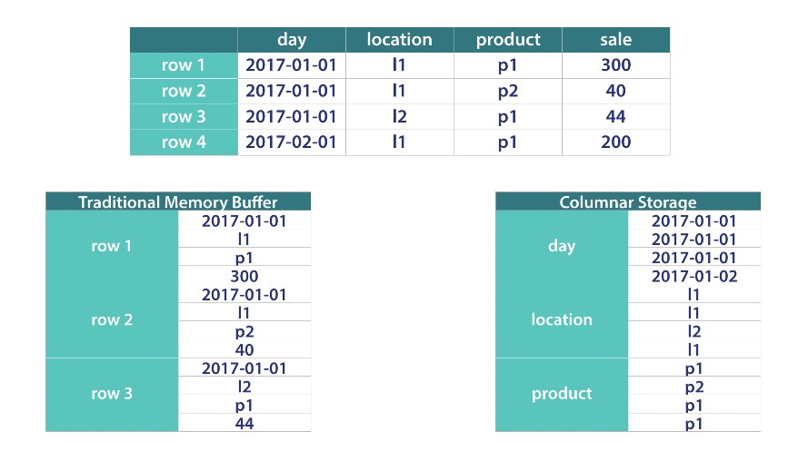
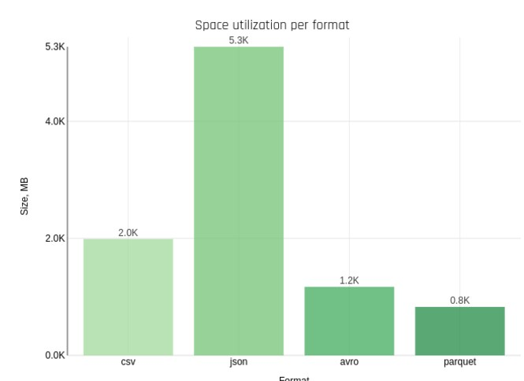
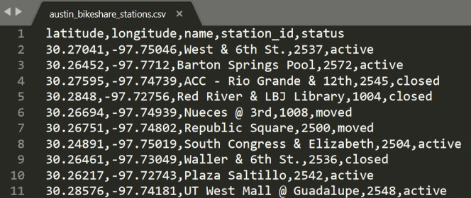
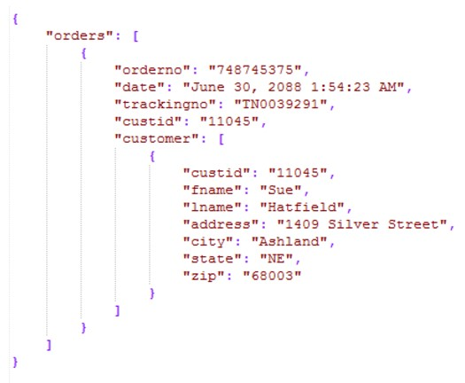
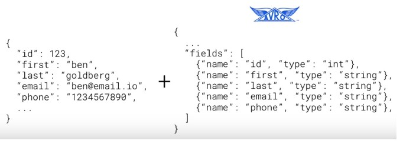
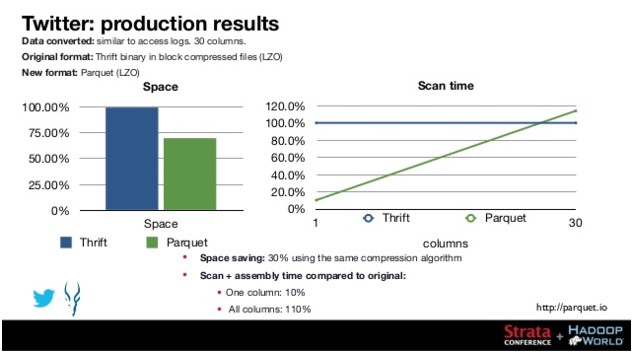
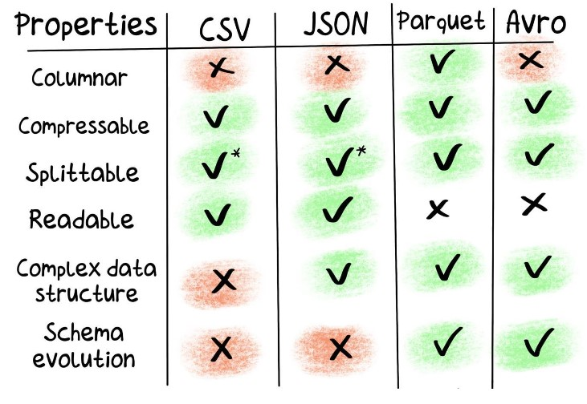
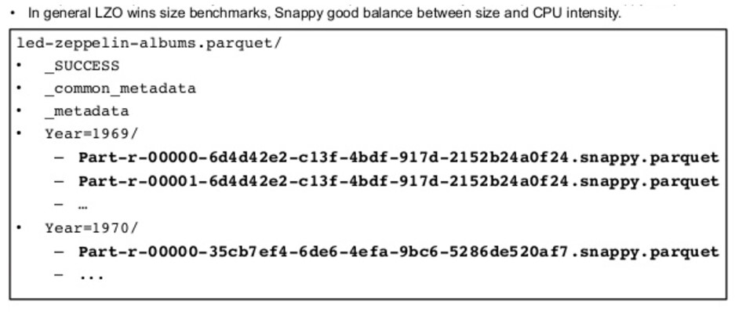

# Formatos de Almacenamiento

La elección de un formato correcto puede traducirse en mejoras de performance y reducción de costos.

## Factores de elección

Al momento de elegir un formato de almacenamiento, debemos considerar los siguientes puntos:
* ROW vs COLUMN: las consultas serán de tipo SELECT * o agregaciones AVG, SUM, etc

* SCHEMA EVOLUTION: que sucede si debemos agregar, eliminar o modificar un campo

* COMPRESSION: equilibrio entre espacio en disco utilizado y tiempo de procesamiento

[Enlace recomendado](https://luminousmen.com/post/big-data-file-formats)

### CSV

Texto plano delimitado por el carácter de la coma (pueden utilizarse otros separadores).
Generalmente este formato lo utilizan aplicaciones tradicionales para exportar datos hacia otros sistemas.

### JSON

### Avro

Almacena los datos en formato binario para reducir el tamaño y mejorar la performance.
La definición de los datos (schema) se almacena en formato JSON.
Es recomendable utilizarlo para consultas de tipo SELECT *.

### Parquet

Es un formato de almacenamiento columnar que surge de la colaboración de Twitter y Cloudera.
Los datos se almacenan en formato binario y al final del archivo se agrega la metadata (schema).
Este formato es ideal para agregaciones AVG, SUM, etc.

### Resúmen

#### Enlaces de referencia:

* [Parquet] (https://parquet.apache.org/documentation/latest/)
* [Avro] (https://avro.apache.org/docs/current/)
* [JSON] (https://www.json.org/json-es.html)

### Herramientas de compresión de datos de Hadoop

* gzip - org.apache.hadoop.io.compress.GzipCodec
* bzip2 - org.apache.hadoop.io.compress.BZip2Codec
* LZO - com.hadoop.compression.lzo.LzopCodec
* Snappy - org.apache.hadoop.io.compress.SnappyCodec
* Deflate - org.apache.hadoop.io.compress.DeflateCodec

#### Ejemplo de Parquet y Snappy

## Prácica En Clase

### Formatos de Almacenamiento en Hive

1) En la sección de archivos, cargar los archivos de la carpeta data y replicar la misma estructura de directorios en HDFS.
2) En la sección de mis documentos, cargar el archivo clase-04.json y luego seleccionar el editor Hive

## Homework

En el M3 se trabajó con con conjunto de datos que simulaban una empresa de venta de productos, deberás tomar ese mismo proceso de ETL y realizarlo con las herramientas Big Data que se verán en este módulo. Para esto, se provee de un entorno integrador:
https://github.com/soyHenry/DS-M4-Herramientas_Big_Data

Realizar el ejercicio propuesto en el punto 3 de la práctica integradora.