# SQL - NoSQL

## SQL

Las bases de datos relacionales, RDBMS son universalmente utilizadas prácticamente por todas las empresas, están estructuradas y optimizadas para asegurar la consistencia y exactitud de los datos, mientras también eliminan Redundancia.
Estas bases se almacenan en grandes y confiables servidores para asegurar que los datos estén siempre disponibles.

Características:
* Formato tabular
* Tipos de datos
* Relaciones (JOINS)
* Restricciones (PK, FK)

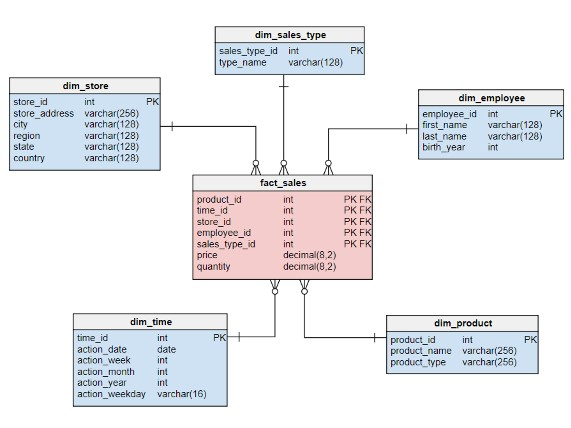

## NoSQL

Los sitios web de escala global (Amazon, Google, Facebook) fueron los primeros en desarrollar y utilizar estos sistemas.
Son sistemas de administración de bases de datos no-relacionales, distribuidas, de código abierto, escalables y con datos almacenados en diferentes formatos.
Una base de datos NoSQL (“Not Only SQL”) es una manera efectiva de organizar gran cantidad de datos heterogéneos con acceso y actualizaciones de datos eficientes.
Esto se logra flexibilizando algunas restricciones de integridad y redundancia en el almacenamiento de datos propias de bases de datos relacionales, RDBMS (“Relational
Database Management Systems”).
Big Data genera mucha cantidad de datos y a gran velocidad siendo las bases de datos relacionales no adecuadas para esa tarea, y sería también muy costoso su Almacenamiento.
Administrar el costo y la velocidad de esta enorme cantidad de datos heterogéneos requiere relajar muchas de las reglas estrictas y requerimientos de RDBMS.
Dependiendo de qué restricciones son modificadas, surgirá un tipo diferente de estructura de bases de datos, llamadas NoSQL.
Las bases de datos NoSQL son bases de próxima generación no-relacionales en su diseño. Son muy útiles para analizar y utilizar masivas cantidades de datos de datos estructurados o no estructurados almacenados en servidores remotos.

Características
* Casos de uso específicos
* Esquema flexible
* Escalabilidad horizontal
* No utilizan SQL ni JOINS

## ACID vs BASE

NoSQL no soporta el esquema relacional y las propiedades asociadas con los procesos 
transaccionales propios de RDBMS, ACID (“Atomicity, Consistency, Isolation, Durability”).
En cambio soporta propiedades BASE (“Basically Available, Soft State, Eventually Consistent”).
Las bases NoSQL son aproximadamente precisas en cualquier punto del tiempo y eventualmente consistentes.

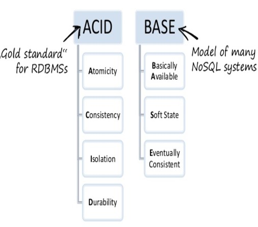

### RDBMS – ACID

* Atomicidad: la ejecución de cada transacción es atómica, se realizan todas las acciones o ninguna.
* Consistencia: Cada transacción preserva la integridad.
* Aislamiento: Una transacción no puede afectar a la Otra.
* Durabilidad: Persistencia de los cambios luego de un “COMMIT”.

### BASE

NoSQL – Base

* Básicamente disponible: garantiza la disponibilidad de los datos, responde a cada solicitud.
* Soft State: El estado del sistema puede cambiar en el tiempo, (consistencia eventual).
* Consistencia eventual: el sistema “eventualmente” es consistente una vez que termina de recibir datos, los datos se propagan y el sistema no chequea la consistencia de cada transacción antes de mover a la siguiente.

## Teorema CAP

Un sistema es considerado Consistente (“Consistency”) si todas las réplicas contienen el mismo valor.
Un sistema es considerado Disponible (“Availability”) si los datos están disponibles en todo momento.
Un sistema tiene tolerancia a Particiones (“Partition Tolerance”) si el procesamiento puede continuar en ambas particiones en dos o más “islas”.
Es importante también que la data sea consistente y esté disponible aún ante un fallo en la red que deje “particionada” la base en “islas”.
De acuerdo con el Teorema CAP no es posible proveer simultáneamente más de dos de las tres propiedades (Consistencia, Disponibilidad, Particionado).

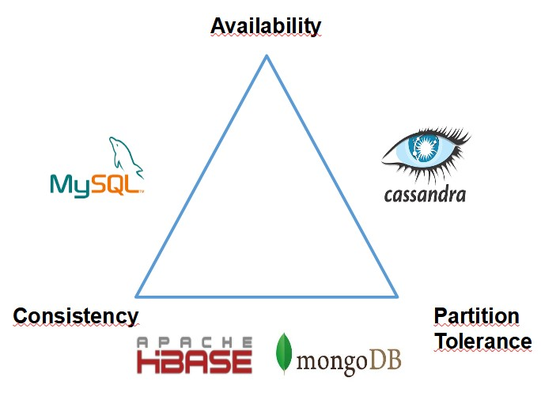

Se sacrifica consistencia a cambio de mayor rendimiento a través de la distribución de los datos.
Ningún sistema distribuido está a salvo de las fallas de la red, por lo tanto, la partición de la red generalmente tiene que ser tolerada.
En presencia de una partición, quedan dos opciones: consistencia o disponibilidad.
Al elegir la consistencia sobre la disponibilidad, el sistema devolverá un error o un tiempo de espera si no se puede garantizar que la información particular esté actualizada debido a la partición de la red.
Al elegir la disponibilidad por consistencia, el sistema siempre procesará la consulta e
intentará devolver la versión disponible más reciente de la información, incluso si no puede garantizar que esté actualizada debido a la partición de la red.
En ausencia de falla de la red, es decir, cuando el sistema distribuido se está ejecutando normalmente, se puede satisfacer tanto la disponibilidad como la consistencia.

## Tolerancia a Particiones

Con frecuencia, CAP se malinterpreta como si uno tuviera que elegir abandonar una de las tres garantías en todo momento. De hecho, la elección entre la consistencia y la 
disponibilidad se da solo cuando ocurre una partición de red o falla; en cualquier otro momento, no hay que hacer concesiones.
Los sistemas de base de datos diseñados teniendo en cuenta las garantías tradicionales de ACID, como RDBMS, eligen la consistencia sobre la disponibilidad; mientras que los sistemas diseñados en torno a la filosofía BASE, comunes en el marco NoSQL, eligen la disponibilidad sobre la consistencia.

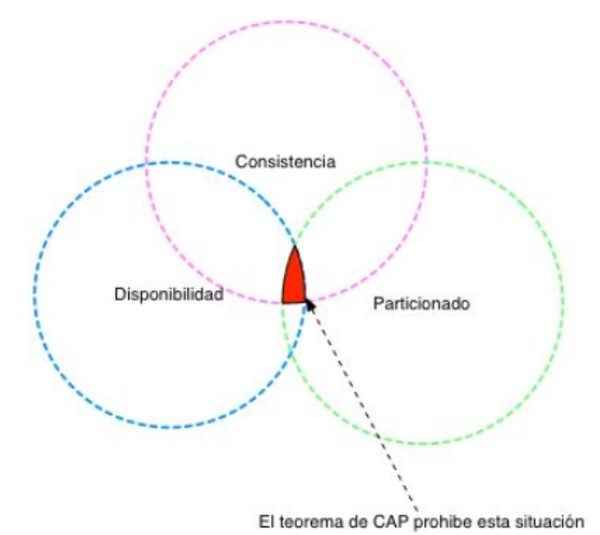

### Consistencia

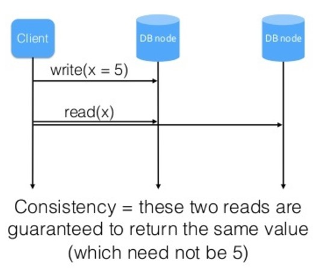

### Disponibilidad

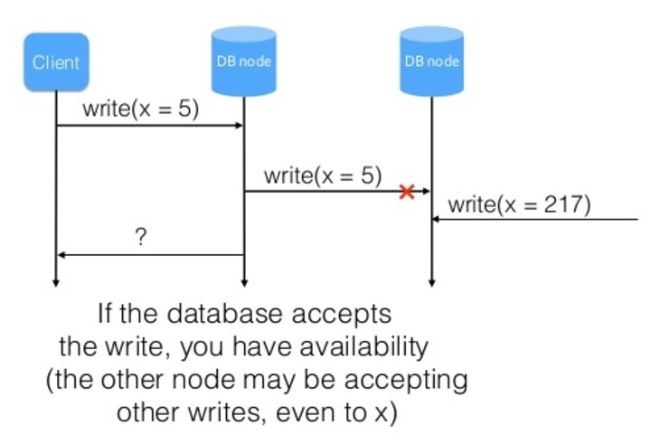

### Enlace recomendado:

[SQL - NoSQL] (https://www.freecodecamp.org/news/nosql-databases-5f6639ed9574/)

## Práctica En Clase

1) Instrucciones para la configuración del ambiente

* sudo apt install -y docker-compose
* git clone https://github.com/soyHenry/DS-M4-PgAdmin_Postgres
* cd DS-M4-PgAdmin_Postgres
* sudo docker-compose up -d
* sudo docker cp clase-05.sql pgadmin_container:/home/clase-05.sql
* Conectarse a PgAdmin en “<ip>:5050”
* Agregar un nuevo servidor: 
    Host name/address: postgres 
    Port: 5432 
    Username: postgres 
    Password: changeme 

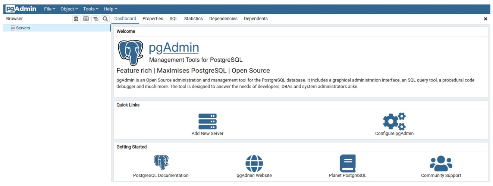

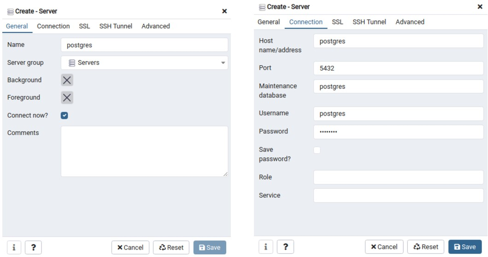

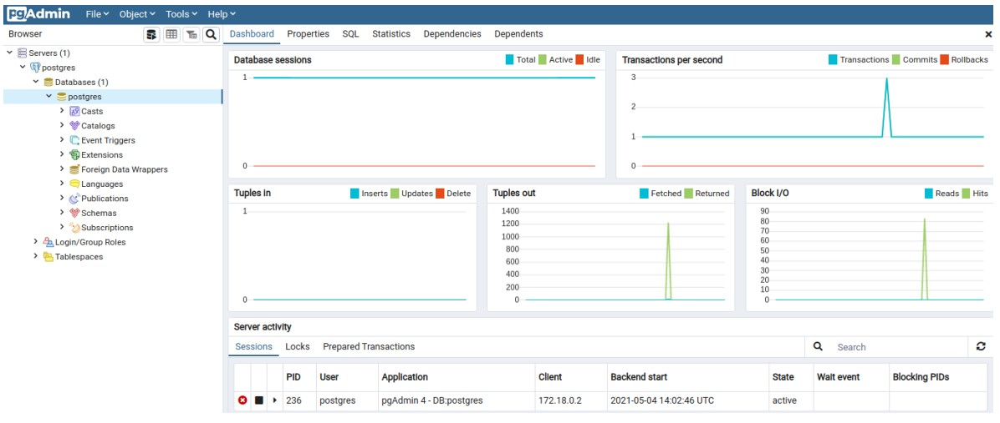

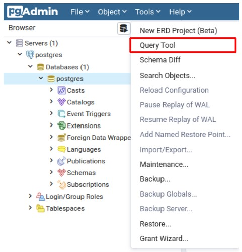

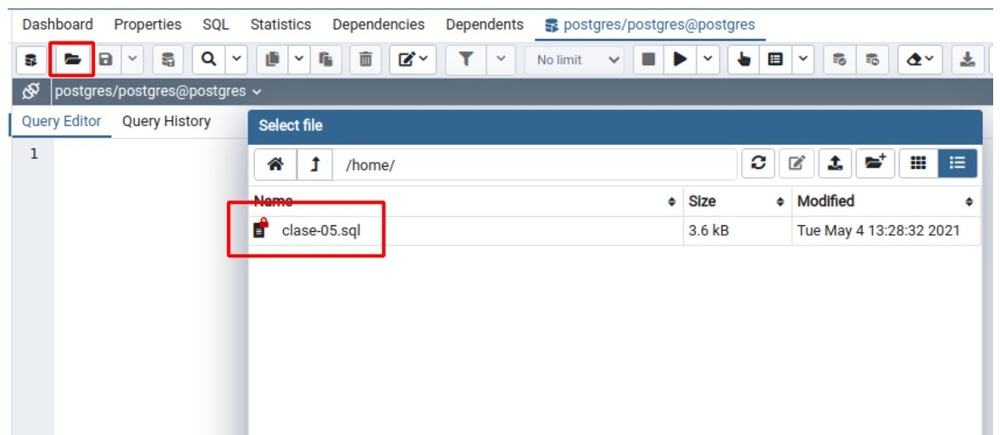

## Homework

En el M3 se trabajó con con conjunto de datos que simulaban una empresa de venta de productos, deberás tomar ese mismo proceso de ETL y realizarlo con las herramientas Big Data que se verán en este módulo. Para esto, se provee de un entorno integrador:
https://github.com/soyHenry/DS-M4-Herramientas_Big_Data

Realizar el ejercicio propuesto en el punto 4 de la práctica integradora.