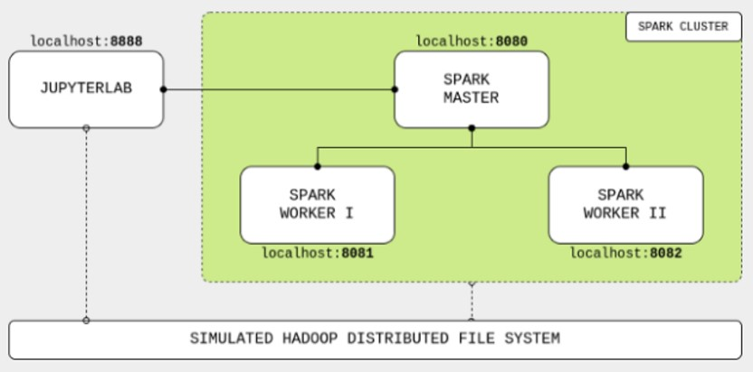

# Apache Spark

Apache Spark es un motor para procesamiento a gran escala de datos, integrado, rápido, "in memory" y de propósito general.
Tienen su propio sistema de "Cluster Management" y utiliza Hadoop solo como almacenamiento.
Spark está escrito en Scala y provee APIs en Java, Scala, Python y R.

Características:
* Computación en memoria.
* Tolerancia a fallos.
* Multipropósito.

Spark es ideal para tareas de procesamiento iterativo e interactivo de grandes "data sets" y flujos de datos ("streaming").
Brinda una performance entre 10-100x mayor que Hadoop operando con construcciones de datos ("data constructs") llamadas "Resilient Distributed Datasets" (RDDs), esto ayuda a evitar latencias en tareas de lectura y escritura en discos.
Es una alternativa a MapReduce.

* [Caso de Uber] (https://www.slideshare.net/databricks/spark-meetup-at-uber)
* [Caso de Apple] (https://www.slideshare.net/databricks/apache-spark-at-apple-with-sam-maclennan-and-vishwanath-lakkundi)
* [Caso de Netflix] (https://www.slideshare.net/databricks/migrating-to-apache-spark-at-netflix)

## Arquitectrua Spark

Spark tiene una arquitectura de capas bien definida donde todos los componentes están relacionados e integrados con extensiones y librerías.

Está basado en dos abstracciones:
* RDD (Resilient Distributed Dataset)
* DAG (Directed Acylic Graph)

Cada tarea de Spark crea un DAG de etapas de trabajo para que se ejecuten en un determinado cluster.
En comparación con MapReduce, el cual crea un DAG con dos estados predefinidos (Map y Reduce), los grafos DAG creados por Spark pueden tener cualquier número de etapas Spark con DAG es más rápido que MapReduce por el hecho de que no tiene que escribir en disco los resultados obtenidos en las
etapas intermedias del grafo.
Gracias a una completa API, es posible programar complejos hilos de ejecución paralelos en unas pocas líneas de código.

Es un grafo dirigido que no tiene ciclos, es decir, para cada nodo del grafo no hay un camino directo que comience y finalice en dicho nodo. Un vértice se conecta a otro, pero nunca a sí mismo; para cada vértice v, no hay un camino directo que empiece y termine en V.
Spark soporta el flujo de datos acíclico.

### Arquitectura Spark - Hadoop

### RDD 

Es la estructura fundamental de datos de Apache Spark, una colección de objetos que se computan en diferentes nodos del Cluster.

* Resilient (tolerante a fallos), capacidad de recomponer particiones de datos dañadas o perdidas por fallos en nodos.
* Distributed, los datos residen en varios nodos. 
* DataSet, representa registros de los datos, que el usuario puede cargar en forma de archivos JSON, CSV, texto o bases de datos por medio de JDBC sin una estructura de datos específica.

Todas las aplicaciones en Spark poseen un manejador central de programa (Driver) y varios ejecutores que se crean a lo largo del clúster, estas son las computadoras que realizarán las tareas en paralelo y finalmente devolverán los valores al driver, la aplicación central.

### Operaciones sobre RDD

Para poder realizar estas tareas, Spark posee desde su versión 1.0 los RDD (Resilient Distributed Dataset), los cuales son tolerantes a fallos y pueden ser distribuidos a lo largo de los nodos del clúster.
Los RDD pueden ser creados al cargar datos de manera distribuida, como es desde un HDFS, Cassanda, Hbase o cualquier sistema de datos soportado por Hadoop, pero también por colecciones de datos de Scala o Python, además de poder ser leídos desde archivos en el sistema local.
En visión general, un RDD puede ser visto como un set de datos los cuales soportan solo dos tipos de operaciones: transformaciones y acciones.
Las transformaciones permiten crear un nuevo RDD a partir de uno previamente existente, mientras que las acciones retornan un valor al driver de la aplicación. El núcleo de operación del paradigma de Spark es la ejecución perezosa (Lazy), es decir que las transformaciones solo serán calculadas posterior a una llamada de acción.
Además, los RDD poseen una familiaridad con el paradigma orientado a objetos, lo cual permite que podamos realizar operaciones de bajo nivel a modo. Map, filter y reduce son tres de las operaciones más comunes.
Una de las grandes ventajas que ofrecen los RDD es la compilación segura; por su particularidad de ejecución perezosa, se calcula si se generará un error o no antes de ejecutarse, lo cual permite identificar problemas antes de lanzar la aplicación. El pero que podemos encontrar con los RDD es que no son correctamente tratados por el Garbage collector y cuando las lógicas de operación se hacen complejas, su uso puede resultar poco práctico, aquí entran los DataFrames.

### DataFrames

Colección de RDD’s con esquema.
Características
* Los datos están organizados en columnas nombradas.
* Es equivalente a una tabla en una base de datos relacional.

Esos componentes fueron agregados en la versión 1.3 de Spark y pueden ser invocados con el contexto espacial de Spark SQL. Como indica su nombre, es un módulo especialmente desarrollado para ser ejecutado con instrucciones parecidas al SQL estándar.
De la misma forma, como los RDD, estos pueden ser creados a partir de archivos, tablas tipo Hive, bases de datos externas y RDD o DataFrames existentes.
El primer detalle que salta cuando creamos un DataFrame es que poseen columnas nombradas, lo que a nivel conceptual es como trabajar con un DataFrame de Pandas. Con la excepción que a nivel interno Spark trabaja con Scala, lo cual le asigna a cada columna el tipo de dato Row, un tipo especial de objeto sin tipo definido.
Pero no es todo, los DataFrames implementan un sistema llamado Catalyst, el cual es un motor de optimización de planes de ejecución, parecido al que usan las bases de datos, pero diseñado para la cantidad de datos propia de Spark, aunado a eso, se tiene implementado un optimizador de memoria y consumo de CPU llamado Tungsten, el cual determina cómo se convertirán los planes lógicos creados por Catalyst a un plan físico.

### Dataset

Es una extensión del Dataframe.
Características:
* Clases fuertemente tipadas.
* Verificación de tipos de dato en tiempo de compilación.
* Disponible sólo en Scala y Java.

### Particionado

Los RDD son la capa de abstracción primaria para poder interactuar con los datos que viven en nuestro ambiente de Spark. Aunque estos puedan ser enmascarados con un esquema dotándolos de las facultades propias de los DataFrames, la información de fondo sigue operando como RDD.
Por lo tanto, la información, como indica el nombre de los RDD, se maneja de forma distribuida a lo largo del clúster, facilitando las operaciones que se van a ejecutar, ya que segmentos de información pueden encontrarse en diferentes ejecutores reduciendo el tiempo necesario para acceder a la información y poder así realizar los cálculos necesarios.
Cuando un RDD o DataFrame es creado, según las especificaciones que se indiquen a la aplicación de Spark, creará un esquema de particionado básico, el cual distribuirá los datos a lo largo del clúster. Siendo así que al momento de ejecutar una acción, esta se ejecutará entre los diversos fragmentos de información que existan para poder así realizar de la forma más rápida las operaciones. Es por eso que un correcto esquema de particionado es clave para poder tener aplicaciones rápidas y precisas que además consuman pocos recursos de red.
Otra de las tareas fundamentales es la replicación de componentes y sus fragmentos, ya que al aumentar la disponibilidad de estos podremos asegurar una tolerancia a fallos, mientras más se replique un valor es más probable que no se pierda si existe un fallo de red o energía, además de permitir una disponibilidad casi inmediata del archivo buscado.
La partición y replicación son elementos que deben ser analizados según el tipo de negocio o requerimientos que se tengan en el desarrollo que se encuentre en progreso, por lo cual la cantidad de datos replicados o granularidad de datos existentes en los fragmentos dependerá en función de las reglas de negocio.

## Módulos Spark

#### Spark Core

Brinda velocidad dando capacidades de computación ”in-memory”. Spark Core es la base del procesamiento distribuído de grandes datasets.

#### SparkSQL
https://spark.apache.org/sql/

* Lenguaje provisto para tratar con datos estructurados.
* Permite ejecutar consultas sobre los datos y obtener resultados útiles.
* Soporta consultas a través de SQL y HiveQL.

#### Spark Streaming
https://spark.apache.org/streaming/

* Permite procesamiento de flujos en forma escalable, rápida y tolerante a fallos. 
* Spark divide los “streams” de datos en pequeños “batches”.
* Puede acceder a orígenes de datos como Kafka, Flume, Kinesis o sockets TCP. 
* Trata a cada “batch” de datos como RDDs y los procesa.
* Puedo operar con varios algoritmos. 
* La data procesada se almacena en el file system y bases de datos.

#### Spark MLlib
https://spark.apache.org/mllib/

* Es una librería escalable de Machine learning.
* Contiene librerías para implementar algoritmos de ML, por ejemplo clustering, regression y Filtrado colaborativo.
* El workflow ML incluye estandarización, normalización, hashing, algebra lineal, estadísticas.

#### Spark GraphX
https://spark.apache.org/graphx/

* Es un motor de análisis de grafos.
* Extiende Spark RDD brindado una abstracción gráfica de grafos dirigidos con propiedades asignadas a cada nodo y vértice.

## Catalyst Optimizer

Es un motor de optimización de planes de ejecución, parecido al que usan las bases de datos, pero diseñado para la cantidad de datos propia de Spark. 
Además de eso, se tiene implementado un optimizador de memoria y consumo de CPU, llamado Tungsten, el cual determina cómo se convertirán los planes lógicos creados por Catalyst a un plan físico.

### Enlaces de Referencia:

* Pagina oficial Spark http://spark.apache.org/
* Github Spark https://github.com/apache/spark
* Spark Packages https://spark-packages.org/
* Databricks https://docs.databricks.com/getting-started/try-databricks.html
* https://github.com/rb-one/Cuso_Introductorio_de_Spark/blob/master/Notes/notes.md

# Procesamiento Batch

Es el procesamiento de transacciones por lote.
Los trabajos que pueden ejecutarse sin la interacción del usuario final, o pueden programarse para ejecutarse según lo permitan los recursos.
Ej. Reporte anual de ventas.

# Procesamiento Streamming - Herramientas

Procesamiento de datos a medida que se producen o reciben (flujo de datos en movimiento).
Los datos se crean como una serie de eventos a lo largo del tiempo.

Ejemplos
* Eventos de sensores
* Clicks en un sitio web
* Operaciones financieras

## Arquitectura Lambda

Es una arquitectura de procesamiento de datos diseñada para gestionar grandes volúmenes de datos que combina los métodos Batch y Streaming
Esta arquitectura es atribuida a Nathan Marz, creador de Apache Storm y autor del libro “Big Data: Principles and Best Practices of Scalable Real-time Data Systems”

### Capas

### Tecnologías

### Kafka

Sistema de cola de mensajes distribuido que utiliza el patrón productor-consumidor

Componentes:
* Topics: categorías para los mensajes
* Producers: envian mensajes a un topic 
* Consumers: se suscriben a topics
* Brokers: nodos que forman el cluster

### Spark Streaming

Es el módulo de Spark que nos permite ingestar y procesar flujos de datos continuos.
Utiliza micro-batching para dividir flujos de datos continuos en batches correspondientes a un periodo de tiempo acotado.
Posibles fuentes de datos : Kafka, Flume, AWS Kinesis, TCP Sockets, Twitter

#### Enlaces recomendados:

* Flink https://flink.apache.org/
* Kafka https://kafka.apache.org/documentation/
* Kafka https://enmilocalfunciona.io/aprendiendo-apache-kafka-parte-1/
* Kafka https://enmilocalfunciona.io/aprendiendo-apache-kafka-parte-2-2/
* Kafka https://enmilocalfunciona.io/aprendiendo-apache-kafka-parte-3-conceptos-basicos-extra/
* Kafka https://enmilocalfunciona.io/aprendiendo-apache-kafka-parte-4/
* Kafka https://enmilocalfunciona.io/aprendiendo-apache-kafka-parte-3-configuracion-de-multiples-brokers/
* Kafka https://enmilocalfunciona.io/aprendiendo-apache-kafka-parte-3-configuracion-con-replicacion/
* Kafka https://enmilocalfunciona.io/acelerando-los-desarrollos-con-contenedores-infraestructura-de-apache-kafka/
* Kinesis https://aws.amazon.com/es/kinesis/

## Práctica En Clase

1) Databricks: Para ejecutar los ejercicios en los notebooks vamos a necesitar
un cluster: https://docs.databricks.com/getting-started/quick-start.html#quick-start 

Al registrarse en Databricks seleccionar "Get Started with Community Edition": 
 

* DataFrames (Python): Cargar el notebook "Dataframes (Python).ipynb" 
* Datasets (Scala): https://docs.databricks.com/_static/notebooks/getting-started/iotdevicegeoipds.html 
1.1) Crear Cluster 
 
1.2) Importar Notebook 
 
1.3) Ingresar URL 
 
1.4) Adjuntar Cluster y Ejecutar 
 
2) Spark Streaming:  
En Databricks ejectuar el notebook:
* https://docs.databricks.com/_static/notebooks/structured-streaming-python.html
3) Flink:  
* https://github.com/ververica/sql-training/wiki  
* https://github.com/ververica/sql-training/tree/master/slides  
* https://github.com/ververica/sql-training/wiki/Setting-up-the-Training-Environment  
3.1) Entorno 
 
3.2) Flink Web UI 
 
3.3) Ejecutar Consulta 
 
3.4) Visualizar Resultados 
 
3.5) Job Status 
 
3.6) Detalle de Ejecución 
 
4) Cluster Spark: 
 
* git clone https://github.com/soyHenry/DS-M4-Cluster_Spark 
* Modificar los yml de 512m a 4098m 
* sudo docker-compose up 
https://towardsdatascience.com/apache-spark-cluster-on-docker-ft-a-juyterlab-interface-418383c95445 
### Enlaces sugeridos:
* https://github.com/wurstmeister/kafka-docker 
* https://github.com/bitnami/bitnami-docker-kafka 
* https://github.com/spotify/docker-kafka 

## Homework

En el M3 se trabajó con con conjunto de datos que simulaban una empresa de venta de productos, deberás tomar ese mismo proceso de ETL y realizarlo con las herramientas Big Data que se verán en este módulo. Para esto, se provee de un entorno integrador:
https://github.com/soyHenry/DS-M4-Herramientas_Big_Data

Realizar el ejercicio propuesto en el punto 6 de la práctica integradora.